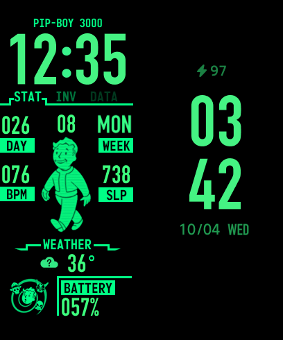

# Fallout Pip-Boy Watchface for Xiaomi Smart Band 8

A fork of [fordus/pip-boy](https://github.com/fordus/pip-boy) that adds a Pip-Boy styled always-on display, a ready-to-install `.bin`, and an open-source build that works with [Gadgetbridge](https://gadgetbridge.org/) (no Windows tools or Mi Fitness required).



## What's different from upstream

- **Always-on display restyled.** Upstream ships the watchface maker's default AOD template: white outline digits and Chinese weekday names. Here the AOD uses Pip-Boy green, the main face's time digits, and English weekday names (SUN–SAT). Layout and the other AOD elements are unchanged.
- **Prebuilt `.bin`** in [Releases](../../releases), tested on a Xiaomi Smart Band 8 (`miwear.watch.m66gl`) with Gadgetbridge.
- **`tools/build.py`** turns any [mibandwatchfaces.com Band 8 maker](https://www.mibandwatchfaces.com/mi_band8_watchface_maker/) project (`wfDef.json` + `images/` + `images_aod/`) into a working Band 8 `.bin` on Linux/macOS.

The main face is identical to upstream.

## Install (Gadgetbridge)

1. Pair the band with Gadgetbridge (you need the band's auth key).
2. Download `pip-boy-mb8.bin` from [Releases](../../releases) to your phone.
3. Open it with **Gadgetbridge FW/App installer** and tap **Install**.
4. Select the face on the band (long-press the current face).

If you installed an earlier build with the same ID, delete it from Gadgetbridge's watchface list first; the band may otherwise keep the old copy.

Flashing custom files to a wearable is at your own risk.

## Build from source

Requires Python 3 and a JDK (`javac`, `java`).

```sh
tools/build.py                       # -> dist/pip-boy-mb8.bin
tools/build.py path/to/maker-export  # build another maker project
tools/build.py --id 266210096 --name "my face"   # install side by side with another build
```

The packer, [Mi8WfBinTool](https://github.com/zhy8388608/Mi8WfBinTool), is downloaded at a pinned commit on first run and cached in `tools/.cache/`; it is not included in this repository.

Why the extra steps are needed (and what does not work on the Band 8) is written up in [docs/FORMAT-NOTES.md](docs/FORMAT-NOTES.md).

## Credits

- [fordus](https://github.com/fordus/pip-boy): original watchface design and artwork
- [mibandwatchfaces.com](https://www.mibandwatchfaces.com/mi_band8_watchface_maker/): Band 8 watchface maker
- [zhy8388608/Mi8WfBinTool](https://github.com/zhy8388608/Mi8WfBinTool): `.bin` packer used by the build
- [Pzqqt/MiBand8_WatchFace_Colorful_Lines](https://github.com/Pzqqt/MiBand8_WatchFace_Colorful_Lines): reference Band 8 binary used to verify the format
- [ooflet/Mi-Create](https://github.com/ooflet/Mi-Create) and the [EasyFace wiki](https://github.com/m0tral/EasyFace/wiki): data source table and Band 8 limitations

## Legal

This is an unofficial, non-commercial fan project. It is not affiliated with or endorsed by Bethesda Softworks, ZeniMax Media, or Xiaomi. Fallout, Pip-Boy and Vault Boy are trademarks of Bethesda Softworks LLC.

The watchface artwork comes from [fordus/pip-boy](https://github.com/fordus/pip-boy), which is published without a license and marked "for personal use only". That restriction carries over to the artwork and the prebuilt `.bin` in this fork: personal use only, no redistribution or commercial use.

The build tooling in `tools/` is original work and is licensed separately under the MIT License (see [tools/LICENSE](tools/LICENSE)).
